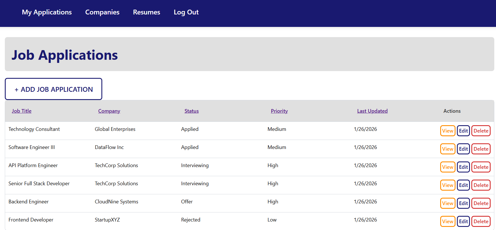

# Job Applications Tracker

A full-stack web application for managing job applications, companies, and resumes. Built with Node.js, Express, MongoDB, and EJS templating.



Link: [Use the app](https://google.com)

[Planning materials](https://trello.com/b/veKVZ6fw/job-application-tracker)

## Features

### 📋 Job Application Management

- Track job applications with status, priority, and source
- Link applications to companies and resumes
- Sort and paginate through applications
- Set priority levels (Low, Medium, High)
- Track application dates and URLs

### 🏢 Company Database

- Maintain a database of companies you're interested in/have worked at (for resumes)
- Store company websites, descriptions, and personal notes
- View all job applications per company
- Prevent duplicate company entries
- Use companies in the database to add experiences/projects to your resume fo

### 📄 Resume Management

- Create and manage multiple resumes
- Track resume components:
  - Professional experience with dates
  - Education history
  - Projects (with optional links)
  - Certifications
  - Skills
- Modern resume display
- Link resumes to specific job applications

### 🔐 User Authentication

- Secure user registration and login
- Session-based authentication with encrypted passwords
- User-specific data isolation

## Tech Stack

**Backend:**

- Node.js & Express 5
- MongoDB with Mongoose ODM
- Express Session with MongoDB store
- bcrypt for password hashing

**Frontend:**

- EJS templating engine
- Custom CSS with modular stylesheets
- Responsive design (needs some work on the list/index displays for mobile)

**Development:**

- Nodemon for auto-restart
- Morgan for HTTP request logging
- Method-override for RESTful routes

## Installation

### Prerequisites

- Node.js (v14 or higher)
- MongoDB (local or Atlas account)

### Setup

1. **Clone the repository:**

```bash
git clone <repository-url>
cd job-applications-tracker
```

2. ** Install dependencies:**

```bash
npm install
```

3. ** Configure environment variables: **
   Create a .env file in the root of the directory:

```
MONGODB_URI=mongodb://localhost:27017/job-tracker
# Or use MongoDB Atlas:
# MONGODB_URI=mongodb+srv://<username>:<password>@cluster.mongodb.net/job-tracker
# DEMO_USER=demo

SESSION_SECRET=your-secret-key-here
PORT=3000
```

4. If running locally, start MongoDB with:
   `mongod`

5. ** Run the app:**
   `npm run dev`
   Or for production mode:
   `npm start`

6. ** Access the app from the browser: **
   By default, available at http://localhost:3000

## Usage Guide

### Seeding the database

1. Create a user account through the registration page (user account name should correspond to DEMO_USER in .env)
2. Run the seed script:
   `npm run seed`

### Project Structure

```
job-applications-tracker/
├── controllers/ # Route handlers
│ ├── auth.js # Authentication logic
│ ├── companies.js # Company CRUD operations
│ ├── jobApps.js # Job application management
│ └── resumes.js # Resume management
├── db/
│ └── connection.js # MongoDB connection
├── middleware/
│ └── authMiddlewares.js # Authentication & authorization
├── models/ # Mongoose schemas
│ ├── company.js
│ ├── jobApp.js
│ ├── resume.js
│ └── user.js
├── public/
│ └── stylesheets/ # CSS files
├── routes/ # Express route definitions
│ ├── auth.js
│ ├── companies.js
│ ├── index.js
│ ├── jobApps.js
│ └── resumes.js
├── seed/
│ └── db.js # Database seeding script
├── views/ # EJS templates
│ ├── auth/
│ ├── companies/
│ ├── jobApps/
│ ├── resumes/
│ └── partials/
├── .env # Environment variables (not tracked)
├── .gitignore
├── package.json
└── server.js # Application entry point
```

## Future Enhancements

- **Global Error Handling**: Implement async wrapper utility
- **Null Check Middleware**: Add validation middleware to check for non-existent resources before rendering views
- **Application Deadlines**: Add deadline tracking with visual indicators for upcoming due dates
- **Email Notifications**: Send reminders for application deadlines and follow-ups
- **Resume PDF Export**: Generate and download resumes as PDF files
- **Interview Scheduling**: Track interview dates, times, and notes
- **Cover Letter Templates**: Create and manage cover letter variations
- **Job Posting Integration**: Scrape or import job posting details from URLs
- **Reset Password**: Proper password reset form
- **Resume AI Tailor**: API endpoint to tailor resume to specific job posting
- **Copy Button On List Form**: Endpoint and UI to duplicate items for each model & feed data into new form
- **Publish Resume**: Boolean on resume model to publish to public URL
- **Activity timeline & associated models**: calls, emails, interviews, tasks, events - todo & past
